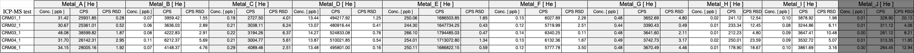

```{r setup, include=FALSE}
knitr::opts_chunk$set(echo = FALSE)
```

## **1.Certified Reference Material (CRM 1566b)**

CRM 1566b, derived from oyster tissue, is a well-characterized certified reference material used to validate analytical methods for trace metal analysis. Its biological matrix is similar to that of squid tissue, which makes it a suitable proxy for method validation in studies involving marine organisms. The selection of CRM 1566b ensures comparability, reliability, and accuracy in the assessment of trace metal concentrations in the biological tissues studied in the current project.

For more details on CRM1566b see <https://tsapps.nist.gov/srmext/certificates/1566b.pdf>.


## **2.Certified Mass Fraction Values**

The table below summarizes the certified values provided for CRM 1566b (Oyster Tissue), including their associated uncertainties: 

```{r Certified Values, message = FALSE, warning = FALSE}
library(knitr)
library(kableExtra)
library(tidyr)
library(dplyr)
certified_values <- data.frame(
  Element = c("Metal_A", "Metal_B", "Metal_C", "Metal_D", "Metal_E", "Metal_F", "Metal_G", "Metal_H", "Metal_J"),
  Certified_Value_mgkg = c(205.80, 0.37, 1.04, 71.60, 1424.00, 0.666, 2.48, 0.0317, 0.308),
  Uncertainties = c(6.00, 0.01, 0.09, 1.60, 46.00, 0.01, 0.08, 0.0013, 0.009)
)
kable(certified_values, caption = "Table 1: Certified Mass Fraction Values for CRM 1566b",align = c("c", "c", "c"))%>%
kable_styling(full_width = FALSE, position = "left") %>%
column_spec(2:3, width = "6em")  # control width of numeric columns
```

These certified values are used as benchmarks to evaluate the accuracy of the analytical method.


## **3.ICP-MS Measurement Results for CRM**

The following table presents the raw ICP-MS measurements for CRM samples (CRM01–CRM05):


```{r fig1, echo=FALSE, fig.cap="Figure 1: Screenshot of ICP-MS Results"}
library(kableExtra)
library(tidyr)
library(dplyr)

```

These values indicate measured concentrations (in ppb), counts per second (CPS), and their relative standard deviations (RSD), highlighting measurement precision and instrument consistency.


## **4.Accuracy, Precision and Variability of Measured Values**

Mean±Standard deviation of measured values from repeated measurements to provide insights into method reliability. low standard deviation values suggest consistent and reliable measurements across replicates:

```{r mean_SD_table, echo=FALSE}
mean_SD_data <- data.frame(
  Trace_Metals_mgkg = c("Metal_A", "Metal_B", "Metal_C", "Metal_D", "Metal_E", "Metal_F", "Metal_G", "Metal_H", "Metal_J"),
  Certified_Values = c('205.800±6.800','0.370±0.009','1.040±0.090','71.600±1.600','1424±46.000','0.666±0.0009','2.480±0.080','0.032±0.0013','0.308±0.0009'),
  CRM01 = c('151.210±0.420','0.341±0.005','0.900±0.040','64.670±0.810','1203.380±19.860','0.620±0.014','2.300±0.110','0.073±0.009','0.479±0.009'),
  CRM02 = c('150.210±0.780','00318±0.009','1.020±0.060','64.030±0.260','1196.400±5.160','0.599±0.015','2.170±0.010','0.0713±0.009','0.406±0.025'),
  CRM03 = c('221.340±4.130','00349±0.010','1.020±0.060','65.720±0.500','1225.140±5.790','0.624±0.001','2.190±0.050','0.061±0.003','0.430±0.045'),
  CRM04 = c('155.230±4.580','0.553±0.032','1.010±0.060','67.920±0.370','1243.920±16.730','0.642±0.011','2.400±0.080','0.077±0.018','0.443±0.022'),
  CRM05 = c('167.390±3.210','0.365±0.017','1.400±0.040','66.080±0.100','1226.030±7.280','0.605±0.021','2.350±0.100','0.054±0.010','0.4853±0.015')
)
kable(mean_SD_data, caption = "Table 3: Mean±Standard deviation of measured values for accuracy, precision and variability", align = c("c", "c", "c"))
```


## **5.Recovery Percentages**

This table evaluates the analytical method's accuracy by calculating the recovery rate for each trace metal.
  **Recovery Rate = (Mean of Measured values/Certified Value) * 100**.

```{r recovery_data, echo=FALSE}
recovery_data <- data.frame(
  Trace_Metals = c("Metal_A", "Metal_B", "Metal_C", "Metal_D", "Metal_E", "Metal_F", "Metal_G", "Metal_H", "Metal_J"),
  CRM01= c('73.48%','91.97%','86.29%','90.32%','84.51%','93.13%','92.68%','228.90%','155.41%'),
  CRM02= c('72.99%','85.61%','98.53%','89.43%','84.02%','89.91%','87.53%','224.98%','131.65%'),
  CRM03= c('107.55%','94.10%','97.70%','91.78%','86.04%','93.73%','88.40%','191.22%','139.58%'),
  CRM04= c('75.43%','149.19%','97.38%','94.86%','87.35%','96.42%','96.64%','242.02%','143.68%'),
  CRM05 = c('81.34%','98.35%','134.96%','92.30%','86.10%','90.91%','94.86%','169.47%','157.58%'),
  Average_Recovery_Rate= c('82.16%','103.85%','102.97%','91.74%','85.60%','92.82%','92.02%','211.32%','145.58%')
)
kable(recovery_data, caption = "Table 4: Recovery Percentages of Measured Values for Accuracy in Analytical Method",align = c("c", "c", "c"))%>%
  row_spec(8, color = "red") %>%
  row_spec(9, color = "red")
```

Recoveries falling within 80–120% indicate satisfactory accuracy, whereas those outside the range suggest potential systematic error or matrix effects.


## **6.Certified vs Measured Values**

```{r Certified vs Measured Values, echo=FALSE, message = FALSE, warning = FALSE}
library(ggplot2)
library(tidyr)
library(dplyr)
cert_vs_meas <- data.frame(
  Element = c("Metal_A", "Metal_B", "Metal_C", "Metal_D", "Metal_E", "Metal_F", "Metal_G", "Metal_H", "Metal_J"),
  Certified = c(205.8, 0.371, 1.04, 71.6, 1424, 0.666, 2.48, 0.0317, 0.308),
  Measured = c(mean(c(151.21, 150.21, 221.34, 155.23, 167.39)),
               mean(c(0.341, 0.0318, 0.0349, 0.553, 0.365)),
               mean(c(0.90, 1.02, 1.02, 1.01, 1.40)),
               mean(c(64.67, 64.03, 65.72, 67.92, 66.08)),
               mean(c(1203.38, 1196.40, 1225.14, 1243.92, 1226.03)),
               mean(c(0.620, 0.599, 0.624, 0.642, 0.605)),
               mean(c(2.30, 2.17, 2.19, 2.40, 2.35)),
               mean(c(0.0726, 0.0713, 0.0606, 0.0767, 0.0537)),
               mean(c(0.4786, 0.4055, 0.4299, 0.4425, 0.4853)))
)
# Pivot to long format
long_data <- pivot_longer(cert_vs_meas, cols = c(Certified, Measured), names_to = "Type", values_to = "Concentration")

# Set Element as a factor to preserve custom order
long_data$Element <- factor(long_data$Element, levels = c("Metal_A", "Metal_B", "Metal_C", "Metal_D", "Metal_E", "Metal_F", "Metal_G", "Metal_H", "Metal_J"))

# Plot with lines
ggplot(long_data, aes(x = Element, y = Concentration, group = Type, color = Type)) +
  geom_line(size = 1.2) +
  geom_point(size = 3) +  # Optional: keep to show data points
  labs(
    title = "Line Chart Showing Certified vs Measured Values",
    y = "Concentration (mg/kg)",
    x = "Element",
    color = "Data Type"
  ) +
  theme_minimal() +
  theme(legend.position = "right")
```


## **7.Summary and Conclusion**

The validation of the analytical method using CRM 1566b demonstrated:

-Good agreement with certified values for most elements.
-High precision shown by low standard deviations across replicates.
-Some elements (Metal_H and Metal_J) showed high recoveries, indicating potential overestimation possibly due to matrix effects or contamination.

Overall, the method showed acceptable accuracy and precision for trace metal analysis in marine tissue, validating its use for analyzing squid tissue in this project.

Further method optimization may be needed for elements with recoveries outside the acceptable 80–120% range.